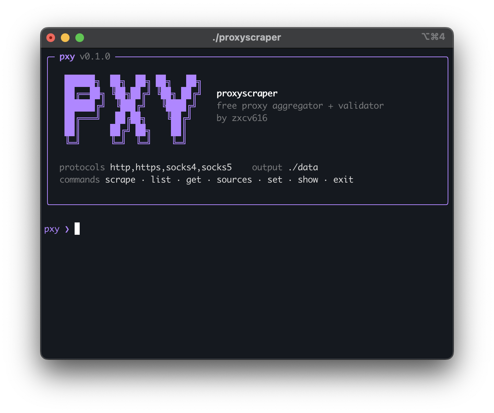

# proxy-scraper



A free proxy **aggregator + validator**. It pulls pre-scraped proxy lists from
15 public sources, dedupes them, tests each one concurrently against a judge
endpoint, and gives you back only the proxies that actually work — ranked by
latency. Ships an interactive shell and matching direct subcommands.

Personal/educational use. Free public proxies are unreliable by nature; don't
route sensitive or authenticated traffic through them. — by [zxcv616](https://github.com/zxcv616)

## Why this approach

Scraping proxy *websites* directly (parsing their HTML) is brittle — layouts
change, sites rate-limit, and many now sit behind Cloudflare. Instead, this
tool **aggregates the raw output of scrapers that already publish results to
GitHub / public APIs every few minutes**, then does the one thing those lists
skip: it **validates**. Free lists typically have only a 5–15% live rate, so
the validation pass is where the value is.

## Install

Requires [Go](https://go.dev/dl/) 1.22+.

```bash
git clone https://github.com/zxcv616/proxy-scraper
cd proxy-scraper
go build -o proxyscraper ./cmd/proxyscraper
```

## Usage

Two equivalent ways: an interactive shell, or direct commands.

### Interactive shell

Run with no arguments to open the shell:

```
$ ./proxyscraper

pxy ❯ set protocols socks5,http
pxy ❯ scrape
pxy ❯ list 5
pxy ❯ get socks5
pxy ❯ exit
```

Commands:

- `scrape [proto...]` — aggregate + validate + write results; optional one-off protocol filter (`scrape socks5`)
- `list [proto] [N]` — show recent working proxies (default 20)
- `get [proto]` — print the single fastest working proxy
- `sources` — list the upstream proxy lists
- `set KEY VALUE` — change a setting (see `show`)
- `show` — print current settings
- `help`, `exit`

Settings (change with `set`): `protocols`, `concurrency`, `limit`,
`check_timeout`, `fetch_timeout`, `out`.

### Direct commands

```bash
./proxyscraper scrape -protocols socks5,http -concurrency 800 -check-timeout 5s
./proxyscraper list -protocol http -limit 20
./proxyscraper get -protocol socks5        # prints one proxy, pipe-friendly
./proxyscraper sources                      # the 15 upstream lists
./proxyscraper version
```

## Output

Each `scrape` writes two files to the output directory (`./data` by default):

- `proxies.json` — full records: protocol, ip, port, latency, exit IP
- `proxies.txt` — one `protocol://ip:port` per line, latency-sorted

## How it works

1. **Aggregate** — fetch all matching source lists in parallel over HTTPS; one
   dead source never sinks the run. Merge and dedupe by `protocol|ip:port`.
2. **Validate** — route a request through each candidate to a judge endpoint
   (`api.ipify.org`) with a bounded worker pool; keep only those that respond
   with a valid IP that isn't yours. HTTP/HTTPS use Go's native transport,
   SOCKS5 via `golang.org/x/net/proxy`, SOCKS4 via a small custom handshake.
3. **Rank & write** — sort by latency, write JSON + TXT.

## License

MIT
